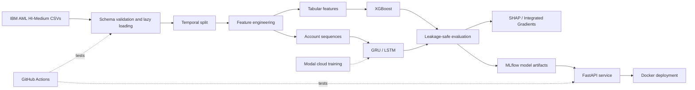

# SeqAML-MLOps

### Explainable sequential anti-money-laundering detection, from raw transactions to a containerized API

[](https://www.python.org/)
[](https://pytorch.org/)
[](https://fastapi.tiangolo.com/)
[](https://www.docker.com/)
[](https://mlflow.org/)

SeqAML-MLOps is an end-to-end machine learning project for scoring the risk of money laundering in financial transactions. Instead of classifying each transaction in isolation, it models an account's recent chronological activity with GRU and LSTM networks and compares them with a strong XGBoost baseline.

The project emphasizes the parts of AML modeling that matter beyond model architecture: leakage-safe preprocessing, rare-event evaluation, interpretable predictions, reproducible experiments, tested inference, and deployable infrastructure.

> **Project status:** active development. This README describes the target system and repository contract. Model results will be added only after the full evaluation pipeline has been completed.

## Why sequential AML detection?

Suspicious behavior is often visible as a pattern rather than a single unusual row. Rapid transfers, abrupt changes in transaction value, repeated payment behavior, and short bursts of activity only become meaningful when transactions are evaluated in context.

Given the most recent transactions for an account, SeqAML-MLOps estimates the probability that the current transaction is associated with laundering activity.

```text
Account history:  T₁ → T₂ → T₃ → ... → T₂₀
                              │
                              ▼
                         GRU / LSTM
                              │
                              ▼
                       AML risk score
```

The project investigates two questions:

1. Does recent account history improve AML risk ranking compared with a strong tabular baseline?
2. Can the selected model be reproduced, explained, tested, and served as a small production-style ML system?

## System overview



| Area | Approach |
|---|---|
| Task | Binary transaction-level AML risk classification |
| Dataset | IBM Transactions for Anti-Money Laundering, HI-Medium configuration |
| Baseline | XGBoost on current and historical aggregate features |
| Sequential models | Single-layer GRU and LSTM classifiers in PyTorch |
| Sequence unit | Chronologically ordered sender-account history |
| Initial context window | Up to 20 transactions, with padding and masking |
| Primary metric | Area under the precision-recall curve (PR-AUC) |
| Explainability | SHAP for XGBoost; Captum Integrated Gradients for GRU/LSTM |
| Experiment tracking | MLflow |
| Cloud training | Modal |
| Serving | FastAPI packaged with Docker |
| Quality controls | Pytest, API tests, Docker build checks, and GitHub Actions |

## Leakage-safe design

Temporal leakage can make an AML model appear far better than it really is. The data pipeline therefore treats leakage prevention as a first-class requirement:

- Transactions are ordered by timestamp and split into train, validation, and test periods.
- A transaction's features and sequence contain no information from later transactions.
- Encoders and scalers are fitted on training data only.
- Class weights are derived from the training split only.
- The operating threshold is selected on validation data only.
- The test set is evaluated once after the model and threshold are frozen.
- Validation and test sets retain their natural class distributions.

These rules are enforced by tests, not left as assumptions in a notebook.

## Repository structure

```text
SeqAML-MLOps/
├── .github/
│   └── workflows/
│       ├── ci-tests.yml              # Runs the test suite on pull requests
│       └── docker-build.yml          # Builds and validates the API image
├── api/
│   ├── app.py                        # /health, /predict, and /model-info
│   ├── schemas.py                    # Validated request and response models
│   └── Dockerfile                    # Reproducible inference image
├── data/
│   ├── raw/                          # Original dataset; never committed
│   └── processed/                    # Parquet and tensor-ready artifacts
├── docs/
│   ├── architecture.mmd              # Mermaid architecture source
│   └── xai_outputs/                  # Saved explanation visualizations
├── notebooks/
│   ├── 01_eda_ibm_aml.ipynb
│   └── 02_xai_visualizations.ipynb
├── src/
│   ├── __init__.py
│   ├── config.py                     # Paths, hyperparameters, and constants
│   ├── preprocessing/
│   │   ├── __init__.py
│   │   ├── load.py                   # Polars loading and schema checks
│   │   ├── features.py               # Historical and transaction features
│   │   ├── sequences.py              # Sequence creation, padding, and masks
│   │   └── leakage.py                # Temporal splits and leakage assertions
│   ├── models/
│   │   ├── __init__.py
│   │   ├── xgb_baseline.py
│   │   └── rnn.py                    # GRU and LSTM definitions
│   ├── training/
│   │   ├── __init__.py
│   │   ├── train_xgb.py
│   │   ├── train_rnn.py
│   │   └── modal_job.py
│   ├── evaluation/
│   │   ├── __init__.py
│   │   ├── metrics.py
│   │   └── threshold.py
│   └── explainability/
│       ├── __init__.py
│       ├── shap_explainer.py
│       └── captum_explainer.py
├── tests/
│   ├── __init__.py
│   ├── conftest.py
│   ├── test_leakage.py
│   ├── test_scalers.py
│   ├── test_models.py
│   └── test_api.py
├── .dockerignore
├── .gitignore
├── docker-compose.yml                # API and MLflow services
├── pyproject.toml
└── README.md
```

Exploratory notebooks may call production modules, but code under `src/` never imports from `notebooks/`.

## Data and preprocessing

The project uses the synthetic **IBM Transactions for Anti-Money Laundering (HI-Medium)** dataset. It provides timestamps, sender and receiver accounts, banks, currencies, payment formats, transaction amounts, and an `Is Laundering` target. Synthetic data makes it possible to study the full workflow without exposing real customer information.

- [IBM AML-Data project and documentation](https://github.com/IBM/AML-Data)
- [Dataset download on Kaggle](https://www.kaggle.com/datasets/ealtman2019/ibm-transactions-for-anti-money-laundering-aml)

The dataset is distributed separately under the CDLA-Sharing-1.0 license; review its terms before downloading or redistributing it.

Raw data is intentionally excluded from Git and Docker images. Place the downloaded CSV files under:

```text
data/raw/
```

Development begins with a smaller, account-preserving subset before scaling to millions of rows or the full dataset. Processed artifacts are persisted as Parquet or tensor-ready files to avoid repeatedly parsing the source CSVs.

Planned features include:

- Log-transformed transaction amounts
- Paid-to-received amount ratios
- Time since the account's previous transaction
- Recent transaction counts and amount statistics
- Payment format and currency encodings
- Fixed-length account sequences with explicit padding masks

Account identifiers are used to construct histories, not as direct predictive features.

## Getting started

The target local environment is Python 3.11 or newer. As implementation files are added, the standard setup will be:

```bash
python -m venv .venv
source .venv/bin/activate
python -m pip install --upgrade pip
python -m pip install -e ".[dev]"
```

The intended training entry points are:

```bash
# Train the tabular baseline
python -m src.training.train_xgb

# Train a recurrent model
python -m src.training.train_rnn --model gru
python -m src.training.train_rnn --model lstm

# Launch the configured cloud training job
modal run src/training/modal_job.py
```

Configuration such as data paths, sequence length, batch size, hidden size, learning rate, and random seed is centralized in `src/config.py` and recorded with every MLflow run.

> These commands represent the planned command-line interface and will become runnable as the corresponding modules land.

## Evaluation protocol

AML is a rare-event problem, so accuracy is not a useful headline metric. Models are compared on the same chronological test period using:

| Metric | What it answers |
|---|---|
| PR-AUC | How well does the model rank rare positive cases overall? |
| Recall | What fraction of laundering transactions are detected? |
| Precision | What fraction of generated alerts are positive? |
| F1 score | How well are precision and recall balanced at the selected threshold? |
| ROC-AUC | How well are positive and negative examples ranked across thresholds? |
| Confusion matrix | What are the operational false-positive and false-negative counts? |

The decision threshold is tuned on the validation split, then frozen before final test evaluation.

### Results

| Model | PR-AUC | Recall | Precision | F1 | ROC-AUC |
|---|---:|---:|---:|---:|---:|
| XGBoost | — | — | — | — | — |
| LSTM | — | — | — | — | — |
| GRU | — | — | — | — | — |

Results will be reported after reproducible experiments are complete, together with the dataset scale, split dates, threshold, and run identifier. The recurrent model is not assumed to win; a leakage-safe negative result is still a valid outcome.

## Explainability

The project uses one explanation method appropriate to each model family:

- **XGBoost + SHAP:** global feature importance and local contribution plots for selected transactions.
- **GRU/LSTM + Integrated Gradients:** feature-by-time-step attributions showing which parts of an account history influenced a risk score.

Explanations describe model influence, not causation. For example, the project may report that recent high-value transactions and short time gaps increased a prediction, but it will not claim that those attributes caused laundering.

## Experiment tracking and cloud training

MLflow records model type, feature configuration, sequence length, hidden size, learning rate, batch size, class weight, epoch count, validation metrics, training time, and saved artifacts. Local development uses account-preserving samples; larger training runs use Modal once the pipeline has passed correctness tests.

To run the local API and MLflow tracking server after their implementation:

```bash
docker compose up --build
```

The inference service exposes:

| Endpoint | Purpose |
|---|---|
| `GET /health` | Liveness and model-readiness check |
| `GET /model-info` | Deployed model and preprocessing metadata |
| `POST /predict` | Validated transaction-sequence risk scoring |

The Docker image packages the selected model and the exact preprocessing artifacts used during training.

## Testing and CI

The test suite focuses on failures that can silently invalidate an ML system:

- Hand-built sequence examples contain no future information.
- Scalers and encoders are never fitted on validation or test data.
- GRU and LSTM outputs have the expected shape and probabilities remain in `[0, 1]`.
- API requests are schema-validated and health checks report model readiness.
- Training and inference use the same preprocessing artifacts.
- Local and Dockerized inference agree for the same input.
- One integration test covers raw sample → preprocessing → model → API response.

Run the suite with:

```bash
pytest
```

GitHub Actions will run tests on pull requests and verify that the Docker image builds successfully.

## Roadmap

- [ ] Validate the raw schema and complete exploratory analysis
- [ ] Implement temporal splitting and leakage assertions
- [ ] Build historical features and the XGBoost baseline
- [ ] Generate padded account sequences and masks
- [ ] Train and compare LSTM and GRU models
- [ ] Select the decision threshold on validation data
- [ ] Add SHAP and Integrated Gradients reports
- [ ] Track reproducible experiments with MLflow
- [ ] Scale a training run with Modal
- [ ] Package inference with FastAPI and Docker
- [ ] Add CI, drift checks, documentation, and a short demo

Advanced dashboards, streaming infrastructure, Kubernetes, graph neural networks, automated retraining, and real bank integrations are deliberately outside the first release.

## Responsible use

This is a portfolio and research project built with synthetic data. It is not a production compliance system and must not be used to make real financial, legal, or customer decisions. Risk scores and explanations require expert review, bias analysis, governance, and institution-specific validation before any real-world use.

## Contributing

Issues and pull requests are welcome. Keep changes small, add tests for behavioral changes, and preserve the temporal-leakage guarantees. Run `pytest` before opening a pull request.

## License

No license has been selected yet. Until a license file is added, standard copyright restrictions apply.
